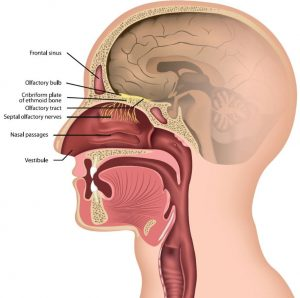
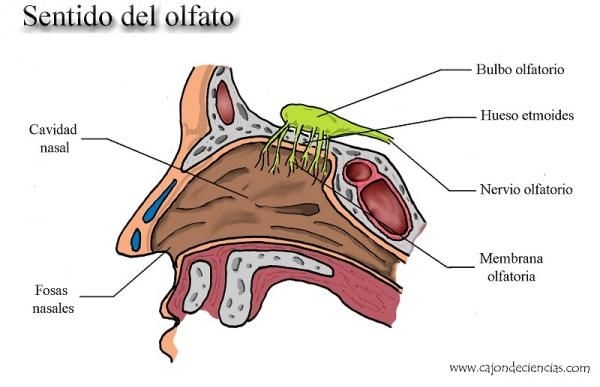

# L'OLFACTE

## Per què serveix l'olfacte?

[Per què serveix l'olfacte?](https://github.com/MiniConde/pq-serveix-olfacte/tree/main)

(pq serveix l'lfacte)

## Anatomia del sentit de l'olfacte

[Anatomia del sentit de l'olfacte](http://google.com)

-__Cavitat nasal:__ Espai dins del nas. La cavitat nasal està damunt de l'os que forma el paladar i es corba cap avall i enrere fins a unir-se amb la gola.

-__Bulb olfactiu:__ Massa rodona de teixit que conté diversos tipus de cèl·lules nervioses que participen en el sentit de l'olfacte. Els bulbs olfactoris reben informació sobre les olors del nas i l'envien a el cervell.

-__Membrana olfactoria:__ La funció dels cilis olfactoris és reaccionar davant els odorants de l'aire que entra a les fosses nasals i posteriorment estimular les cèl·lules olfactives.

-__Nervi olfactiu:__ transmeten informació de l'olfacte per mitjà de la placa cribiforme cap als bulbs i fascicles olfactoris que, al seu torn, transmeten aquesta informació a l'escorça olfactiva en els lòbuls temporals medials.

## Per què quan alguna cosa té una olor molt forta o ens és familiar podem notar gust?
(el pq)

[Per què quan alguna cosa té una olor molt forta o ens és familiar podem notar gust?](http://google.com)

## Malelties de l'olfacte, a què són degudes?

[Malelties de l'olfacte, a què són degudes?](http://google.com)

__Anosmia:__ És la pèrdua de l'olfacte. De vegades és congènita (present des del moment del naixement) i pot ser degut a un trastorn d'origen genètic.

__Hipoòsmia.__ És una reducció en la capacitat per detectar olors.

__Parosmia.__ És un canvi en la percepció normal de les olors, per exemple, quan es distorsiona l'olor d'alguna cosa familiar, o quan alguna cosa que normalment et agradava de sobte es torna desagradable.

__Fantosmia.__ És la sensació de percebre una olor que en realitat no està present

També hi ha el Covid-19 que fa que el gust i l’olfacte es perdin. Depèn de la persona que l’agafi, pot no tenir aquests síntomes o no i fins i tot poden durar més que el temps que es té.

